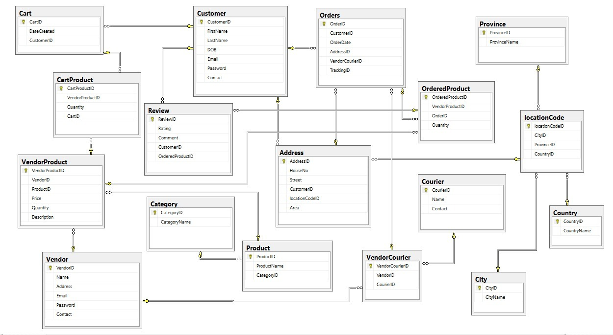
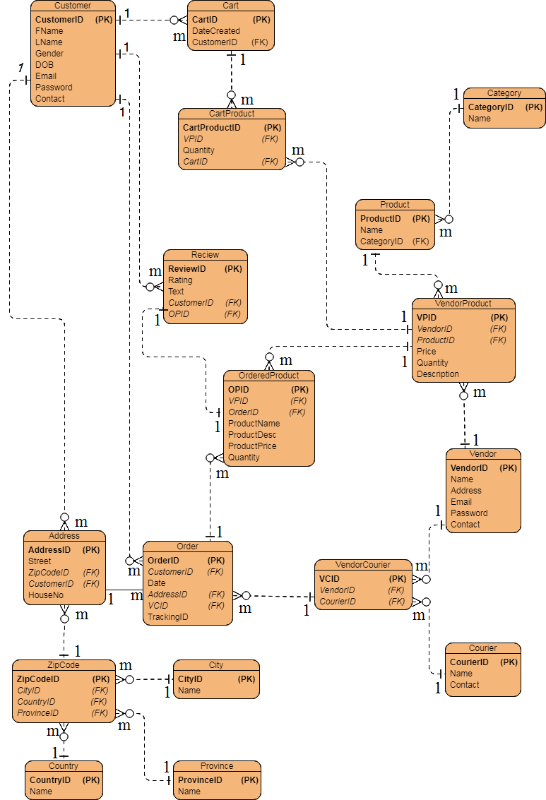

# E-Commerce Database Management System

As a part of our University Curriculum, we made this project for Database Management Systems (DBMS) - COMP 213. This project contains theoretical as well as implementation in SQL. If you liked the repo do star it.

## Pre-requisite

Microsoft SQL Server

## Contents
- Description
- Basic Structure
    - Entity Relation Diagram (ERD)
    - Relational Database Schema
- Implementation
    - Creating Tables
    - Inserting Data
- Queries

## 1. Description

E-Commerce Database Management System (EC-DBMS) is a system that is designed to store, process, retrieve and analyze information concerned with the administrative and management of sales activity done by a customer online sitting at home. This project aims at maintaining all the information pertaining to the customers, vendors, products, and their categories, orders, and couriers. It enables vendors to set up online shops, customers to browse through the shops, and a system administrator to approve and reject requests for new shops and maintain lists of shop categories. The system manages the items in the shop and also helps customers purchase them online without having to visit the shop physically. The online shopping system will use the internet as the sole method for selling goods, products, and services to its consumers. The website will show all products in a categorized manner. Customers can browse any product for its price, other details and can order the product by using their registered account. The customer has to pay the order amount at the time of delivery.

## 2. Basic Structure
2.1 Entity Relation Diagram (ERD)


2.2 Relational Database Schema


## 3. Implementation
3.1 Creating Tables

Complete script is available in `Database & Table Creation` folder.

```sql
CREATE DATABASE OnlineShopping;

Use OnlineShopping;

CREATE TABLE Customer
(
	CustomerID int IDENTITY(1, 1) PRIMARY KEY,
	FirstName varchar(255) NOT NULL,
	LastName varchar(255) NOT NULL,
	DOB date NOT NULL,
	Email varchar(255) NOT NULL,
	Password varchar(255) NOT NULL,
	Contact varchar(255) NOT NULL
);

CREATE TABLE Country
(
	CountryID int IDENTITY(1, 1) PRIMARY KEY,
	CountryName varchar(255) NOT NULL
);

CREATE TABLE Province
(
	ProvinceID int IDENTITY(1, 1) PRIMARY KEY,
	ProvinceName varchar(255) NOT NULL
);

CREATE TABLE City
(
	CityID int IDENTITY(1, 1) PRIMARY KEY,
	CityName varchar(255) NOT NULL
);

CREATE TABLE ZipCode
(
	ZipCodeID int IDENTITY(1, 1) PRIMARY KEY,
	CityID int FOREIGN KEY REFERENCES City(CityID) NOT NULL,
	ProvinceID int FOREIGN KEY REFERENCES Province(ProvinceID) NOT NULL,
	CountryID int FOREIGN KEY REFERENCES Country(CountryID) NOT NULL
);

CREATE TABLE Address
(
	AddressID int IDENTITY(1, 1) PRIMARY KEY,
	HouseNo varchar(255) NOT NULL,
	Street int NOT NULL,
	CustomerID int FOREIGN KEY REFERENCES Customer(CustomerID) NOT NULL,
	ZipCodeID int FOREIGN KEY REFERENCES ZipCode(ZipCodeID) NOT NULL,
	Area varchar(255) NOT NULL
);
```

3.2 Inserting Data

Complete scripts are available in `Data Insertion` folder.

Note: All information is fake and generated for the demonstration of the project.

```sql
use OnlineShopping;

Insert Into Category Values ('Android Smart TV Box/Air Mouse');

Insert Into City Values ('Karachi');

Insert Into Orders Values ('1','2011-01-27','1','318','77425889862');

Insert Into Product Values ('Air Mouse C120 for Android and Smart TV','1');

Insert Into Province Values ('Punjab');

Insert Into Review Values ('4','Great Product Slow delivery. Such slow much wow','1','1');
```

## 4. Queries

Complete scripts are available in `Queries` folder.

### A particular vendor's categories of products he's selling

```sql
select CategoryName
from Category
where CategoryID in
					(select Distinct CategoryID
					from Product
					where ProductID in
									(select ProductID
									from VendorProduct
									where VendorID='3'));
```

### Average Age of Customers

```sql
select sum(DATEDIFF ( year , customer.DOB , getdate() ))/Count(customerid) as "Average Age"
from Customer
```

# Contributors

Do check the contributors to follow some awesome projects

- [@mohammadusman666](https://github.com/mohammadusman666)
- [@abeer04](https://github.com/abeer04)

`Feel free to fork the repository and contribute to this project.`